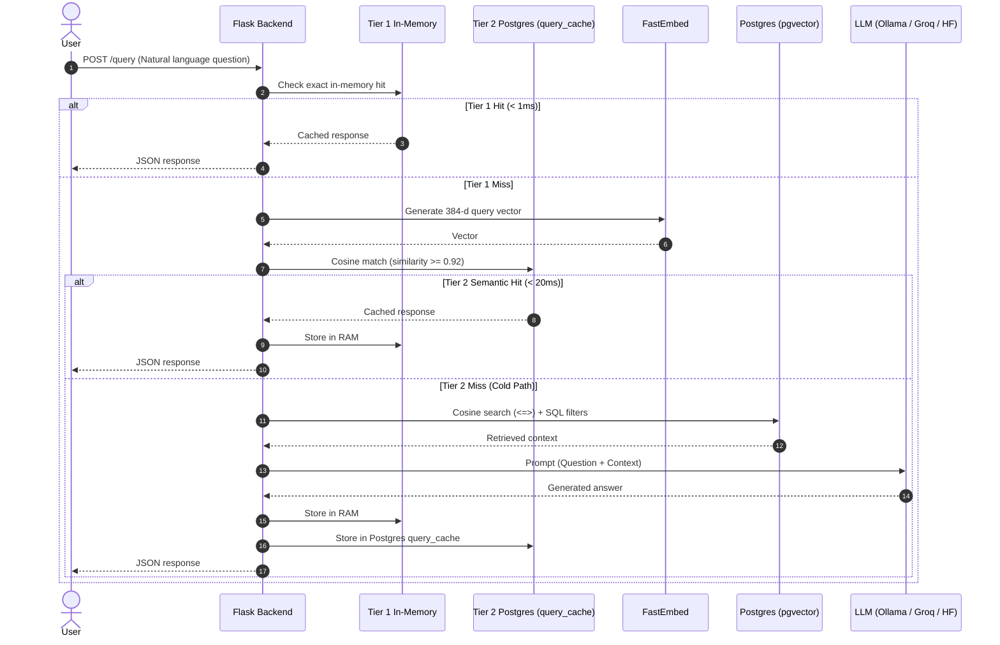

# Technical Overview

This document walks through how the project ingests Strava data, stores vector embeddings in PostgreSQL, and answers natural language questions using a hybrid RAG pipeline.

---

## 1. Data Ingestion & Storage

We pull activity data from Strava either via **webhooks** (in real time) or via **on-demand API sync**:

1. **Fetch**: The backend requests the activity details (distance, duration, elevation, activity type, start timestamp) using Strava OAuth tokens.
2. **Text Representation**: We build a concise text summary for embedding:
   ```text
   "Morning Ride Ride 24000 meters with 320m elevation gain in 3600 seconds"
   ```
3. **Embed**: FastEmbed (`sentence-transformers/all-MiniLM-L6-v2`) converts this text into a 384-dimensional vector.
4. **Save**: The activity metrics and the vector embedding are upserted into PostgreSQL using `pgvector`.

---

## 2. Why Embeddings & Vectors?

Embeddings allow the search layer to understand semantic similarity across phrasing, activity types, and workout intensity, rather than relying on exact keyword matching.

For example:
- `"Morning Jog 5k in 25 mins"` and `"Fast 5000m park run"` produce nearby vectors because their context and effort align closely.
- `"40km road cycle in the hills"` produces a vector located further away in the embedding space.

In PostgreSQL, we search vectors using the cosine distance operator (`<=>`):
```sql
SELECT activity_id, activity_type, distance, duration, elevation_gain,
       1 - (embedding <=> %s::vector) AS similarity_score
FROM activities
WHERE activity_type = 'Run'
ORDER BY embedding <=> %s::vector
LIMIT 10;
```

---

## 3. Retrieval Strategy: Hybrid SQL + Vector Search

Pure vector search isn't always optimal for fitness questions. When someone asks *"How many runs did I do in November 2023?"*, SQL filtering and date math are more precise.

The pipeline combines both approaches:

```
User Query
   │
   ├── 1. Query Analysis & Keyword Check
   │      ├── Superlatives ("longest run", "fastest ride") ──> Direct SQL query
   │      └── Descriptive / General queries ─────────────────> Hybrid Vector Search
   │
   ├── 2. Filter Extraction
   │      ├── Activity types: Run, Ride, Hike, Workout, etc.
   │      └── Temporal filters: "this month", "last year", "past 30 days", explicit years
   │
   └── 3. Filtered pgvector Retrieval
          Applies extracted WHERE clauses on top of cosine similarity ordering.
```

---

## 4. Context Building & LLM Prompting

Once matching activities are fetched from the database, we build a structured context for the LLM:

1. **Derived Metrics**: Convert raw numbers into athlete-friendly metrics:
   - Running: Pace in `min:sec/km`
   - Cycling: Speed in `km/h` and total elevation gain
   - Workouts / Strength: Total duration
2. **Temporal Grounding**: Today's actual date and year are injected so the model can correctly resolve relative terms like *"last month"* or *"this season"*.
3. **Guardrails**: The prompt instructs the LLM to only answer based on provided context and to decline making up unlisted activities.

### Prompt Template Outline
```text
You are a helpful Strava activity assistant.
Today's Date: [Current Date]

Retrieved Activity Context:
1. Ride on 2024-05-10 - Distance: 45.2 km, Duration: 1h 35m, Elevation Gain: 410m, Speed: 28.5km/h
2. Run on 2024-05-08 - Distance: 10.0 km, Duration: 48m 10s, Pace: 4:49/km

User Question: [User Question]

Instructions:
- Base answers strictly on the retrieved context above.
- Group activities by type when multiple types are present.
- Use explicit dates and metrics in your summary.
```

---

## 5. Database Schema

The core table in PostgreSQL (`schema.sql`):

```sql
CREATE EXTENSION IF NOT EXISTS vector;

CREATE TABLE IF NOT EXISTS activities (
    activity_id BIGINT PRIMARY KEY,
    athlete_id VARCHAR(50),
    activity_type VARCHAR(50),
    distance FLOAT,           -- stored in meters
    duration INT,             -- stored in seconds
    elevation_gain FLOAT DEFAULT 0, -- stored in meters
    timestamp TIMESTAMP WITH TIME ZONE,
    embedding vector(384)     -- MiniLM-L6-v2 384-dimensional vector
);

CREATE INDEX IF NOT EXISTS activities_embedding_idx 
ON activities USING ivfflat (embedding vector_cosine_ops)
WITH (lists = 100);
```

---

## 6. Token Management & Background Sync

- **OAuth Tokens**: Athlete access and refresh tokens are stored in a dedicated `strava_tokens` table.
- **Auto-Refresh**: If an access token expires, `token_manager.py` fetches a fresh token from Strava's OAuth endpoint and updates PostgreSQL before executing API calls.
- **Webhooks**: Strava webhook events (`create`, `update`, `delete`) are acknowledged immediately with HTTP 200 and processed asynchronously in background threads.

---

## 7. Two-Tier Semantic Caching

To optimize query latency and eliminate redundant LLM calls on Render's free tier, the system employs a two-tier caching strategy:

1. **Tier 1 (In-Memory `TTLCache`)**: Instant sub-millisecond lookups for text embeddings (1h TTL), exact query strings (30m TTL), and analytics payloads (30m TTL).
2. **Tier 2 (PostgreSQL `query_cache`)**: Persistent semantic vector caching using `pgvector` cosine similarity ($\ge 0.92$). Rephrased or paraphrased questions match previously answered queries with zero LLM cost.
3. **Smart Year-Scoped Invalidation**: Closed historical years (`target_year < datetime.now().year`) are tagged with `is_historical = TRUE` and kept permanently cached. Only the active year and floating/relative queries are cleared when new workouts are uploaded.

