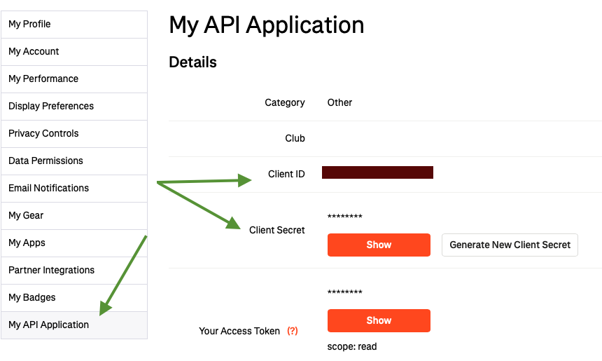
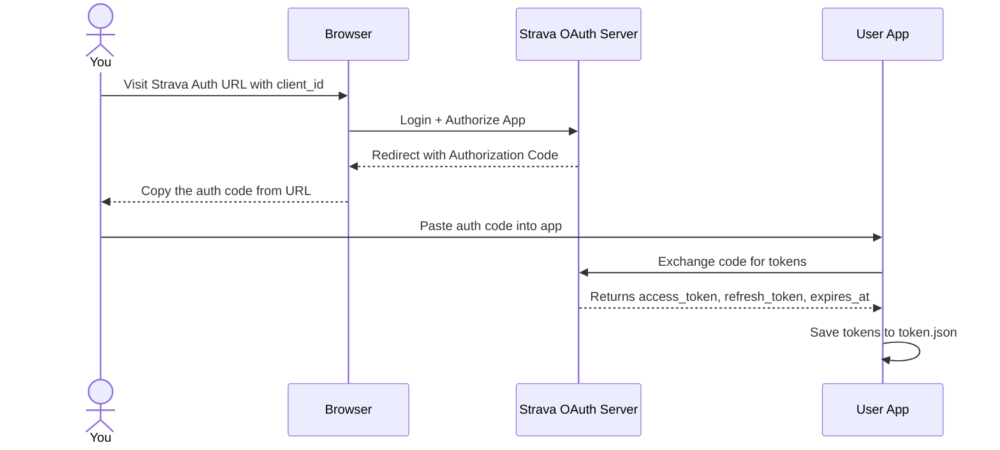
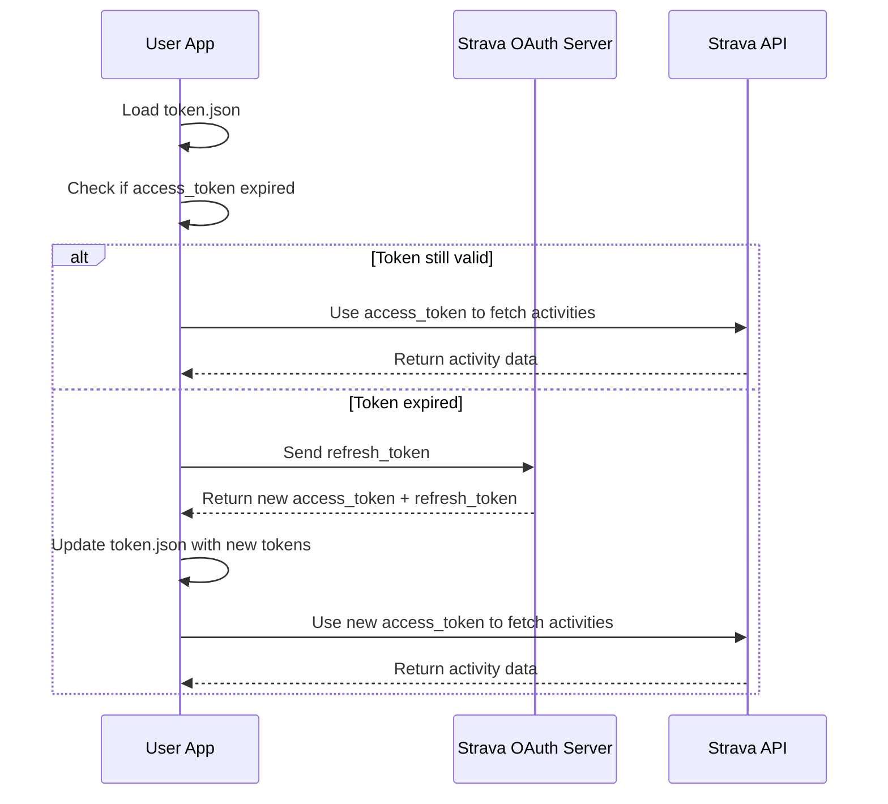

## Strava OAuth

### Prequisite:
Get `client_id` and `client_secret` from 'My API Application' section of your Strava settings.

### OAuth Flow
Strava OAuth is a bit unintuitive and takes some time to wrap your head around. Here's a high-level flow. This is represented in the following diagrams.

* First diagram: Shows the one-time manual OAuth setup process
* Second diagram: Shows the automated token refresh and API usage flow that happens every time you run your app

### First Time Authentication

### Subsequent App Usage
