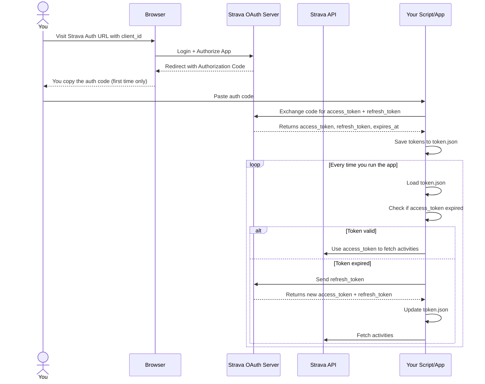

### Strava OAuth

Strava OAuth is a bit unintuitive and takes some time to wrap your head around. Here's a high-level flow.

```mermaid
sequenceDiagram
    actor You
    participant Browser
    participant StravaAuth as Strava OAuth Server
    participant StravaAPI as Strava API
    participant App as Your Script/App

    You->>Browser: Visit Strava Auth URL with client_id
    Browser->>StravaAuth: Login + Authorize App
    StravaAuth-->>Browser: Redirect with Authorization Code
    Browser-->>You: You copy the auth code (first time only)

    You->>App: Paste auth code
    App->>StravaAuth: Exchange code for access_token + refresh_token
    StravaAuth-->>App: Returns access_token, refresh_token, expires_at
    App->>App: Save tokens to token.json

    loop Every time you run the app
        App->>App: Load token.json
        App->>App: Check if access_token expired

        alt Token valid
            App->>StravaAPI: Use access_token to fetch activities
        else Token expired
            App->>StravaAuth: Send refresh_token
            StravaAuth-->>App: Returns new access_token + refresh_token
            App->>App: Update token.json
            App->>StravaAPI: Fetch activities
        end
    end
```