# Walkthrough: Automated Fresh Activity Ingestion & Embedding Pipeline

## Overview
We built and validated an automated, end-to-end synchronization pipeline that captures newly recorded Strava activities (via **real-time Strava Webhooks** or **on-demand incremental sync**), computes 384-dimensional vector embeddings with **`fastembed`**, and persists them directly into **Supabase PostgreSQL**.

---

## Key Components Implemented

```mermaid
sequenceDiagram
    autonumber
    participant Strava as Strava API / Webhook
    participant App as Backend (Render)
    participant FastEmbed as FastEmbed (ONNX)
    participant Supabase as Supabase (pgvector)
    participant UI as Frontend UI

    rect rgb(30, 60, 50)
    Note over Strava,Supabase: Real-Time Webhook Flow
    Strava->>App: POST /strava/webhook (activity.create)
    App-->>Strava: 200 OK (immediate)
    App->>Strava: GET /activities/{id} (fetch details)
    App->>FastEmbed: compute_embedding(text)
    FastEmbed-->>App: 384-d vector list
    App->>Supabase: UPSERT into activities table
    end

    rect rgb(20, 45, 65)
    Note over UI,Supabase: On-Demand / UI Sync Flow
    UI->>App: POST /api/sync
    App->>Supabase: SELECT MAX(timestamp) FROM activities
    App->>Strava: GET /athlete/activities?after={epoch}
    App->>FastEmbed: Batch compute embeddings
    App->>Supabase: Batch UPSERT activities
    App-->>UI: 200 OK {synced_count: N}
    end
```



---

## File Changes Summary

| File | Change Type | Description |
|---|---|---|
| [`backend/token_manager.py`](file:///home/debian/Dev/code/strava-insights-rag/backend/token_manager.py) | **`NEW`** | Resilient OAuth token manager with auto-refresh; persists tokens across container restarts via Supabase `strava_tokens` table with local file & env var fallbacks. |
| [`backend/strava_service.py`](file:///home/debian/Dev/code/strava-insights-rag/backend/strava_service.py) | **`NEW`** | Fetches activity details from Strava, generates 384-d embeddings using `fastembed`, handles database upserts/deletes, and executes incremental sync. |
| [`backend/app.py`](file:///home/debian/Dev/code/strava-insights-rag/backend/app.py) | **`MODIFY`** | Added `GET /strava/webhook` (handshake), `POST /strava/webhook` (async event processor), `POST /api/sync` (on-demand sync), and `GET /api/sync/status`. |
| [`backend/db/schema.sql`](file:///home/debian/Dev/code/strava-insights-rag/backend/db/schema.sql) | **`MODIFY`** | Added `vector` extension and `strava_tokens` table definition. |
| [`frontend/index.html`](file:///home/debian/Dev/code/strava-insights-rag/frontend/index.html) | **`MODIFY`** | Added **🔄 Sync Strava** button, live sync status message, and database activity statistics panel. |
| [`utils/strava/webhook_manager.py`](file:///home/debian/Dev/code/strava-insights-rag/utils/strava/webhook_manager.py) | **`NEW`** | CLI tool to register (`create`), inspect (`view`), and remove (`delete`) Strava push subscriptions. |
| [`tests/test_strava_service.py`](file:///home/debian/Dev/code/strava-insights-rag/tests/test_strava_service.py) | **`NEW`** | Unit tests for timestamp parsing, text formatting, single activity syncing, deletion, incremental sync, and token auto-refresh. |

---

## Verification Results

### Automated Unit Test Suite
Ran 19 tests across all test modules:
```bash
python3 -m unittest discover -s tests -v
```
```text
test_delete_activity (tests.test_strava_service.TestStravaService) ... ok
test_format_activity_text (tests.test_strava_service.TestStravaService) ... ok
test_parse_strava_timestamp (tests.test_strava_service.TestStravaService) ... ok
test_sync_incremental (tests.test_strava_service.TestStravaService) ... ok
test_sync_single_activity (tests.test_strava_service.TestStravaService) ... ok
test_get_valid_access_token_expired_triggers_refresh (tests.test_strava_service.TestTokenManager) ... ok
test_get_valid_access_token_unexpired (tests.test_strava_service.TestTokenManager) ... ok
test_compute_embedding_with_list (tests.test_fastembed_interface.TestFastEmbedIntegration) ... ok
test_compute_embedding_with_mock_array_like_tolist (tests.test_fastembed_interface.TestFastEmbedIntegration) ... ok
test_retrieve_similar_activities_flow (tests.test_fastembed_interface.TestFastEmbedIntegration) ... ok
test_build_context_empty (tests.test_sql_rag.TestSqlRag) ... ok
test_build_context_with_running_activity (tests.test_sql_rag.TestSqlRag) ... ok
test_build_context_workout_without_distance (tests.test_sql_rag.TestSqlRag) ... ok
test_handle_rag_query_no_results (tests.test_sql_rag.TestSqlRag) ... ok
test_handle_rag_query_success (tests.test_sql_rag.TestSqlRag) ... ok

----------------------------------------------------------------------
Ran 19 tests in 0.006s

OK (skipped=4)
```

---

## How to Enable Real-Time Strava Webhooks

1. **Deploy to Render**:
   Commit and push these changes.
2. **Register Webhook Subscription**:
   Run the webhook manager CLI locally (pointing to your Render URL):
   ```bash
   python utils/strava/webhook_manager.py create https://strava-insights-rag.onrender.com
   ```
3. **Verify Active Subscription**:
   ```bash
   python utils/strava/webhook_manager.py view
   ```
4. **Done!** Whenever you finish a run, ride, or workout on Strava, Strava will automatically ping Render, which embeds the activity in seconds and stores it in Supabase.
