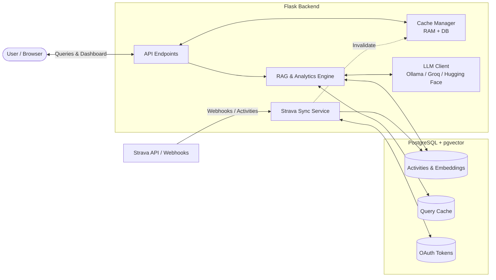
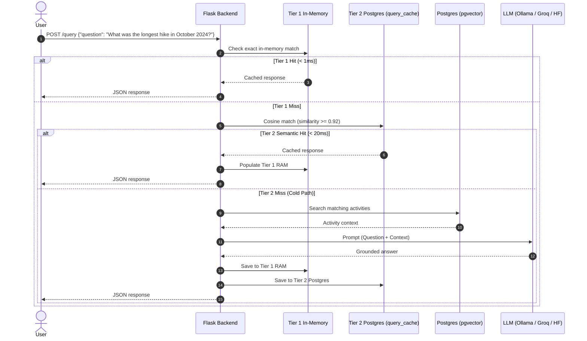
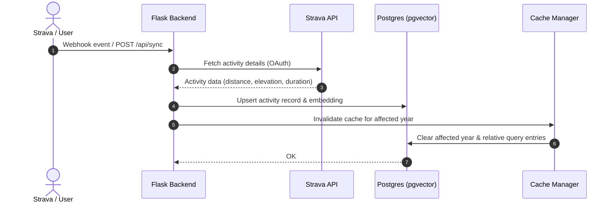
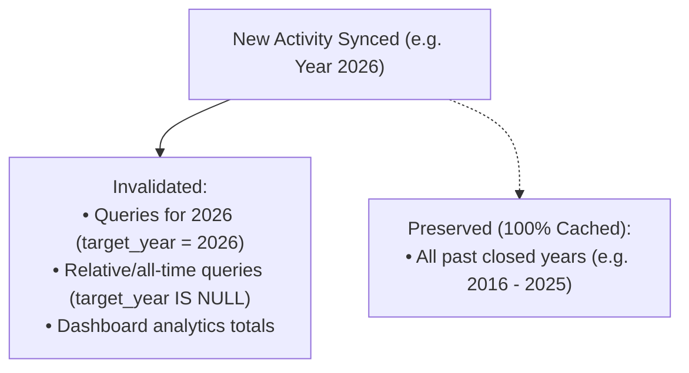

# Strava Insights RAG

This started off as a hobby project to explore RAG and vector embeddings on Strava activity data. Whenever I get some time, I keep refining it.

For more technical notes, check out **[docs/overview.md](docs/overview.md)**.

---

## Architecture



---

## Key Interaction Flows

### 1. Asking a Question (Two-Tier Cached RAG)

When a question is asked, the backend checks the in-memory cache, then checks PostgreSQL for semantically similar previous answers ($\ge 0.92$), and only calls the LLM if there is a cache miss.



### 2. Syncing Activities (Webhooks / On-Demand)

When a new workout finishes on Strava (or when you trigger a manual sync), the app fetches details, generates embeddings, stores them in Postgres, and triggers cache invalidation.



### 3. Year-Based Cache Invalidation

Past closed years are immutable and remain permanently cached. Only the affected activity's year and relative queries are cleared when new workouts arrive:



---

## Prerequisites

```sh
brew install postgresql pgvector ollama
pip install -r requirements.txt
```

### Vector Similarity Metrics in pgvector

> Distance operators in pgvector return **lower values for more similar vectors**.

| Metric | Operator | Best For | Interpretation |
|---|---|---|---|
| **Cosine Distance** | `<=>` | Semantic / contextual similarity | **Lower = More similar** |
| **Euclidean (L2)** | `<->` | Geometric proximity | **Lower = More similar** |
| **Inner Product (neg.)** | `<#>` | Normalized vectors (dot product) | **Lower = More similar** *(negative inner product)* |

---

## Setup & Running

1. Copy `sample.env` to `.env` and fill in your credentials:
```properties
# Strava
STRAVA_USER_ID="YOUR_STRAVA_USER_ID"
STRAVA_CLIENT_ID="YOUR_STRAVA_CLIENT_ID"
STRAVA_CLIENT_SECRET="YOUR_STRAVA_CLIENT_SECRET"

# Database
POSTGRES_DB="stravadb"
POSTGRES_USER="strava_user"
POSTGRES_PASSWORD="YOUR_DB_PASSWORD"
POSTGRES_HOST="localhost"
POSTGRES_PORT="5432"

# LLM Provider (ollama, groq, or huggingface)
LLM_PROVIDER="ollama"
```

2. Start PostgreSQL and Ollama (if using local models):
```sh
brew services start postgresql@14
brew services start ollama
```

3. Run the backend:
```sh
python3 backend/app.py
```
The server will start at `http://localhost:5000`.

---

## Usage

Ask a question:
```sh
curl -X POST http://localhost:5000/query \
  -H "Content-Type: application/json" \
  -d '{"question": "What was the longest run in 2024?"}'
```

Trigger an on-demand sync:
```sh
curl -X POST http://localhost:5000/api/sync \
  -H "Content-Type: application/json" \
  -d '{"limit": 20}'
```